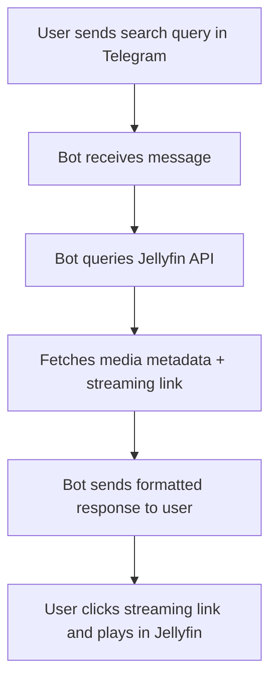

# Jellyfin Telegram Bot

A **Telegram bot** that integrates with **Jellyfin Media Server** to provide quick access to search, fetch, and stream your Jellyfin media library directly from Telegram.

---

## 🚀 Features

* 🎬 **Search Movies/Shows** in your Jellyfin server directly from Telegram.
* 🔗 **Generate secure streaming links** for instant playback.
* 📂 **Browse media metadata** (title, year, description, etc.).
* 🗂️ Temporary media handling with cleanup in `./temp`.
* 📝 Logging of bot activities in `./logs`.
* 🔐 Secure authentication with environment variables stored in `.env`.

---

## 📦 Tech Stack

* **Python 3**
* **Telethon** – Telegram API client.
* **Jellyfin API** – for fetching media data.
* **Logging module** – activity logs.
* **dotenv** – for secure credentials management.

---

## ⚙️ Setup & Installation

1. **Clone the repo**

```bash
git clone https://github.com/vishnudaspk/jellyfin-telegram-bot.git
cd jellyfin-telegram-bot
```

2. **Create virtual environment & install dependencies**

```bash
python -m venv venv
source venv/bin/activate   # Linux/Mac
venv\Scripts\activate      # Windows
pip install -r requirements.txt
```

3. **Configure environment variables**
   Create a `.env` file:

```env
# Telegram API
API_ID=your_telegram_api_id
API_HASH=your_telegram_api_hash
BOT_TOKEN=your_telegram_bot_token

# Jellyfin
JELLYFIN_URL=https://your-jellyfin-server:8096
JELLYFIN_API_KEY=your_jellyfin_api_key

# Paths
TEMP_DIR=./temp
LOG_DIR=./logs
```

4. **Run the bot**

```bash
python bot.py
```

---

## 🔄 Workflow / Pipeline



---

## 📂 Project Structure

```
telegram-jellyfin-bot/
│-- bot.py                # Main bot logic
│-- requirements.txt      # Dependencies
│-- .env                  # Environment variables (ignored in git)
│-- .gitignore            # Ignore sensitive files
│-- JellyfinBotAuto.session # Telegram session file
│-- logs/                 # Bot logs
│-- temp/                 # Temporary downloads
```

---

## 🔒 Security

* `.env` file keeps sensitive data safe.
* `.gitignore` ensures no secrets, logs, or sessions are committed.

---

## 📌 Future Enhancements

* Add **user-specific authentication** for Jellyfin.
* Inline buttons for quick media controls.
* Support for playlists & watchlists.
* Docker support for easy deployment.

---

## 🤝 Contributing

Pull requests are welcome! Feel free to fork, improve, and submit PRs.

---

📜 License

This project is licensed under the MIT License.
